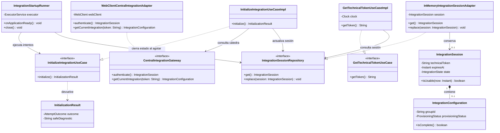
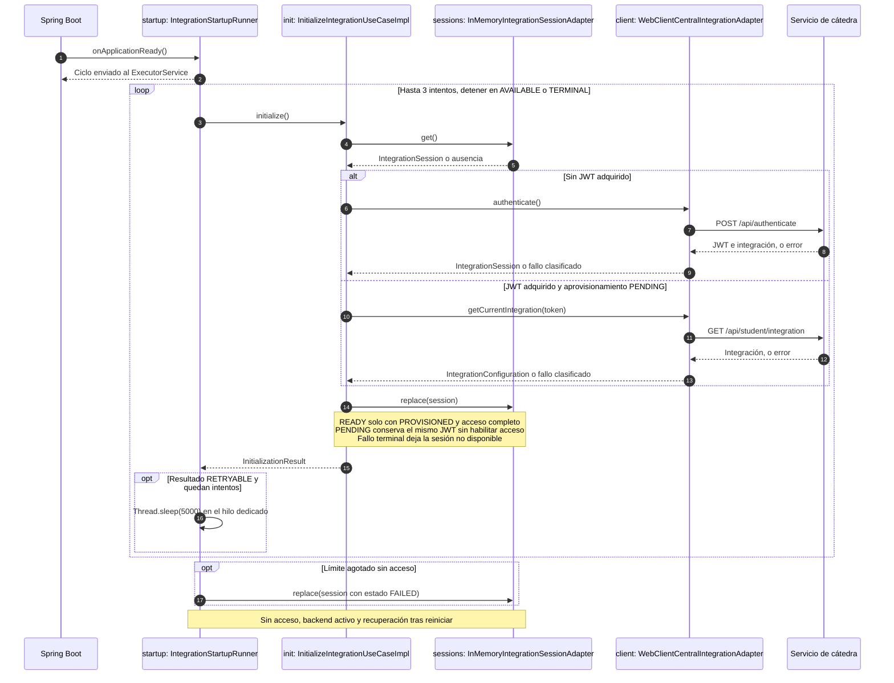

# PLAN: Autenticación técnica y configuración de cátedra

**SPEC de referencia:** [SPEC.md](SPEC.md)
**Versión de la spec revisada:** aprobación del usuario en esta sesión, 2026-10-08; SPEC todavía sin commit.
**Estado:** Aprobado <!-- Borrador | En revisión | Aprobado -->
**Aprobación:** confirmada por el usuario en esta sesión, 2026-10-08. No autoriza implementación.

<!-- PARA LA PERSONA
Copia esta plantilla como PLAN.md junto a la SPEC.md aprobada.
Este documento define la solución técnica. Una vez revisado, el agente puede
derivar TASKS.md con tareas, dependencias y comprobaciones.
-->

<!-- PARA EL AGENTE
- Lee la SPEC.md aprobada, las instrucciones del proyecto y MOBILE_GUIDELINES.md.
  Si falta un documento necesario o la spec no está aprobada, indícalo antes de avanzar.
- Inspecciona el repositorio. Referencia rutas verificadas y distingue las nuevas propuestas.
- Propón una solución proporcional al alcance y coherente con el proyecto.
  Reutiliza lo existente y justifica nuevas dependencias o cambios de arquitectura.
- Distingue hechos, decisiones confirmadas y propuestas. Consulta las decisiones
  no resueltas; haz pocas preguntas por vez y actualiza el plan con las respuestas.
- Referencia los requisitos y criterios por su ID, sin copiar toda la spec.
- Si una decisión cambia el comportamiento o alcance, vuelve a la spec y solicita
  confirmación. No resuelvas una duda de producto mediante una suposición técnica.
- Conserva estos comentarios. No implementes durante la planificación.
- Solicita aprobación antes de marcar el plan como Aprobado. La autorización
  para implementar debe ser explícita; no se deduce del estado de los documentos.
-->

## Contexto técnico verificado

<!-- Qué existe hoy y cómo participa en la funcionalidad. -->

| Componente o archivo existente | Ruta verificada | Responsabilidad y uso previsto |
| --- | --- | --- |
| Aplicación | `src/main/java/com/prog2/catalog/CatalogApplication.java` | Arranque de Spring Boot. |
| Validación de MySQL | `src/main/java/com/prog2/catalog/infrastructure/config/DatabaseConfiguration.java` | Mantener fallo de arranque por configuración local inválida. |
| Configuración | `src/main/resources/application.yaml`, `.env.example`, `compose.yaml` | Incorporar acceso técnico externo y mantener health técnico separado. |
| Build | `pom.xml` | Java 25, Spring Boot 4.1.1; su BOM resuelve Spring Framework 7.0.9. |
| Pruebas existentes | `src/test/java/com/prog2/catalog/CatalogApplicationTests.java` | Regresión de arranque, MySQL, Flyway y health. |
| Contrato externo | [Anexo](../../../../INTEGRATION_REFERENCE-v2.md), secciones 2 a 5 y 13 | Login, configuración, identidad técnica y errores. |

**Convenciones y patrón de referencia:** skill `hexagonal-arch`, paquete base `com.prog2.catalog` sin segmento adicional `hexagonal`. Dominio puro; puertos en dominio; casos de uso en aplicación; HTTP, ejecución de tareas y almacenamiento en memoria en infraestructura. Solo componentes necesarios, sin repositorios JPA ni tablas para este slice. Responsabilidad única, inversión de dependencias y Adapter sirven para aislar el contrato externo; no se añaden patrones sin necesidad.

## Solución propuesta

<!-- Explica el enfoque y sus motivos. Describe las responsabilidades y el
recorrido de datos y eventos hasta la interfaz. Usa un diagrama si aporta claridad. -->

**Decisiones confirmadas:** Catálogo centraliza el login técnico; Turnos recibe el mismo JWT mediante un contrato interno protegido. JWT y configuración se conservan exclusivamente en memoria. Cliente HTTP: `WebClient` de WebFlux, elegido por el usuario para seguir los ejemplos de la materia. La SPEC y este PLAN se aprobaron antes de implementar. Resultados en [TASKS.md](TASKS.md).

**Propuesta de ejecución:** validar configuración local al arrancar y activar un ciclo finito en segundo plano cuando el backend esté listo. Un caso de uso ejecuta un intento; el adaptador de arranque coordina los siguientes según el resultado. Las consultas HTTP no esperan a que termine el ciclo.

- Sin sesión técnica: ejecutar login con `rememberMe: true`.
- Con JWT obtenido y aprovisionamiento `PENDING`: consultar integración actual con ese JWT en el siguiente intento, evitando generar otro JWT por cada consulta.
- Publicar una sesión utilizable solo con `PROVISIONED`, JWT utilizable y configuración completa.
- Mantener la integración no disponible durante fallos, espera y agotamiento. Reiniciar inicia un nuevo ciclo.
- Turnos no hace un login independiente. Obtiene el JWT de Catálogo y consulta a cátedra la configuración que necesita.

**Reparto confirmado con seguridad:** el issue [#13](https://github.com/prog2-perassiferrara/backend-catalogo/issues/13) implementa protección y adaptador HTTP de entrega a Turnos. Este issue #6 prepara el acceso técnico, el almacenamiento, el puerto de consulta y la propuesta contractual. No se publica una ruta sin protección ni se declara operativa la entrega entre servicios antes de verificar #13. Coordinar el consumidor con [Turnos #4](https://github.com/prog2-perassiferrara/backend-turnos/issues/4).

### Diagrama de clases

Un único diagrama muestra las piezas principales de #6. Se incluyen las operaciones y los atributos que explican el flujo; el detalle completo de configuración y estados queda en las secciones siguientes.

**Cómo leerlo:** el runner inicia el trabajo; la implementación del caso de uso consulta cátedra mediante el gateway y guarda la sesión mediante el repositorio. Los adaptadores implementan esas interfaces. La consulta del token comprueba si la sesión es utilizable y no inicia otro login.

`+` indica público y `-` privado. La línea discontinua con triángulo indica implementación de una interfaz; la flecha continua, una referencia entre objetos; el rombo lleno, composición. `0..1` permite que todavía no exista sesión o configuración. Las referencias inyectadas están representadas por las flechas, sin repetirlas todas como atributos.

Puertos y modelos pertenecen al dominio; las clases `UseCaseImpl`, a aplicación; runner y adaptadores, a infraestructura. `IntegrationConfiguration` conserva los campos de REST/Redis/Kafka necesarios para Catálogo, aunque aquí solo se muestran dos para facilitar la lectura. No hay entidades JPA en esta funcionalidad.

### Secuencia de arranque y adquisición de acceso

Los participantes internos son instancias de las clases anteriores (`nombre: Clase`). Spring y cátedra son participantes externos al slice. El executor ejecuta el ciclo en un hilo dedicado, sin bloquear el arranque HTTP.

El caso de uso hace un intento; el runner limita el ciclo y cierra el estado al agotarlo. La interrupción al cerrar Spring termina la tarea. La entrega HTTP del token a Turnos se documentará con sus clases y seguridad en #13; aquí se conserva la propuesta contractual en «Datos y contratos».

## Módulos y componentes afectados

<!-- Si el proyecto está modularizado, identifica los módulos afectados, sus
responsabilidades y la dirección de sus dependencias. Respeta los límites
existentes y justifica cualquier módulo o dependencia nueva. Si no está
modularizado, describe las carpetas o componentes afectados sin introducir
modularización fuera del alcance; marca la tabla de módulos como No aplica. -->

No se crean módulos Maven adicionales. Slice propuesto: `com.prog2.catalog.integration`.

| Módulo | Existe / nuevo | Responsabilidad y cambios | Dependencias afectadas |
| --- | --- | --- | --- |
| Módulo Maven actual | Existe | Incorporar slice de integración técnica. | Mantener BOM y build existentes. |

<!-- Distingue lo que se reutiliza, modifica o crea. Las rutas nuevas son propuestas.
Señala impacto sobre modelos, contratos o componentes compartidos. -->

| Componente o ruta | Acción | Cambio y responsabilidad | Requisito relacionado |
| --- | --- | --- | --- |
| `integration/domain/model/` | Crear | Sesión técnica, configuración y resultado seguro de intento. | RF-02 a RF-06 |
| `integration/domain/enums/` | Crear | Estado local, aprovisionamiento y resultado del intento. | RF-03, RF-05, RF-06 |
| `integration/domain/exception/` | Crear | Fallo del puerto de integración externa, sin tipos HTTP ni dependencias de infraestructura. | RF-05 |
| `integration/domain/ports/in/` | Crear | `InitializeIntegrationUseCase`: un intento; `GetTechnicalTokenUseCase`: consultar token solo si la sesión es utilizable. | RF-02, RF-03, RF-06 |
| `integration/domain/ports/out/` | Crear | `CentralIntegrationGateway`: login y configuración actual; `IntegrationSessionRepository`: leer/reemplazar sesión local. | RF-02 a RF-06 |
| `integration/application/usecases/` | Crear | Implementar intentos, validación de acceso completo y consulta sin exponer estado parcial. | RF-02, RF-03, RF-05, RF-06 |
| `integration/application/exception/` | Crear | Señalar que el caso de uso no puede entregar un token utilizable. | RF-03, RF-06 |
| `integration/infrastructure/client/adapter/` | Crear | Adaptador HTTP de cátedra. | RF-02, RF-04, RF-05 |
| `integration/infrastructure/client/dto/` | Crear | DTO externos y conversión a modelos del dominio. | RF-02, RF-04, RF-05 |
| `pom.xml` | Modificar | Agregar `spring-boot-starter-webflux` para disponer de WebClient, con versión gestionada por el BOM actual. | RF-02 |
| `integration/infrastructure/persistence/adapter/` | Crear | Repositorio en memoria; lectura/reemplazo de una sesión completa, sin tablas ni migraciones. | RF-03, RF-04 |
| `integration/infrastructure/config/` | Crear | Validar propiedades, construir cliente y ejecutar el ciclo limitado en su propia tarea; cerrar estado no disponible al agotarlo. | RF-04, RF-06 |
| `.env.example`, `compose.yaml` | Modificar | Externalizar parámetros y suministrarlos al proceso; ejemplos con secretos vacíos. | RF-04, RF-06 |
| `src/test/java/com/prog2/catalog/integration/` | Crear | Pruebas de comportamiento del slice y sus adaptadores. | CA-01 a CA-11 |
| `CatalogApplicationTests.java` | Modificar solo lo necesario | Proporcionar configuración y servidor HTTP ficticio controlado, sin depender de cátedra real. | Regresión del setup |
| `README.md` | Modificar | Preparación manual, configuración, estado degradado, pruebas y dependencia de #13. | RF-07 |

Las rutas del slice corresponden al diseño implementado en #6. La API de entrega y su DTO pertenecen a la integración posterior con #13, no se añaden como endpoint público en este issue.

Organización ajustada por decisión del usuario, 2026-10-08: seguir el ejemplo del profesor en la medida aplicable, con enums separados. `CentralIntegrationException` pertenece al contrato del puerto externo; `IntegrationUnavailableException`, al caso de uso de aplicación. `client/adapter|dto` adapta la separación de infraestructura al consumo HTTP saliente. Los DTO son públicos para que el adaptador pueda usarlos desde otro paquete; la conversión simple existente se conserva sin añadir un mapper adicional. Esta funcionalidad no requiere una fachada `service`, controladores ni persistencia JPA. La reorganización no cambia el comportamiento ni los contratos HTTP.

Documentación de código acordada el 2026-10-08: Javadoc en español para responsabilidades, contratos, estados y métodos relevantes. Los puertos documentan operaciones y las implementaciones heredan esos contratos; adaptadores y casos de uso añaden sus decisiones particulares. Los patrones Adapter y Repository se identifican donde explican la separación de responsabilidades. Comentarios internos justifican decisiones de recuperación, concurrencia y seguridad. OpenAPI/Swagger se evaluará en las funcionalidades que incorporen APIs HTTP propias.

## Datos y contratos

<!-- Completa solo lo aplicable. Si un punto no aplica, indica el motivo. -->

- **Modelos y contratos de entrada y salida:** propuesta de `IntegrationSession` que agrupa JWT y `IntegrationConfiguration`, separando estado local de `ProvisioningStatus`. El puerto HTTP no devuelve DTO externos ni tipos Spring a aplicación. Resultado de intento distingue disponible, recuperable y terminal, con diagnóstico sin secretos.
- **Identificadores, relaciones y restricciones:** `groupId` identifica la cuenta técnica; verificar que corresponda a la integración esperada. Mantener JWT y configuración como una unidad de sesión. El JWT de cátedra es independiente del JWT propio que autentica a Turnos.
- **Origen de los datos mostrados y transformaciones:** login `POST /api/authenticate` con `username`, `password`, `rememberMe: true`; respuesta `id_token` + `integration`. Consulta `GET /api/student/integration` con bearer técnico; respuesta sin envoltorio. DTO/mappers de infraestructura interpretan el JSON y estados del anexo.
- **Cliente HTTP confirmado:** `WebClientCentralIntegrationAdapter` implementa el puerto del dominio con `WebClient`, usado de forma síncrona mediante `.block()` en el hilo de integración, como en clase, con timeouts finitos. `Mono` y `Flux` quedan dentro de infraestructura; no cambian las firmas de los puertos ni los controladores MVC existentes. No bloquear un hilo de eventos de Reactor. Referencia: [ejemplo de la materia](../../../../toda_la_materia.md), líneas 7643 a 7767.
- **Persistencia, consultas y actualizaciones:** adaptador en memoria con reemplazo atómico de la sesión completa. No registrar objetos con secretos ni generar `toString()` que los incluya. No persisten JWT, configuración o credenciales en MySQL.
- **Convivencia entre datos locales y remotos:** la sesión técnica no equivale a una copia de catálogo vigente. El health mantiene significado técnico. Datos de catálogo y estado funcional se incorporan mediante sus propios issues.
- **Compatibilidad y migraciones de datos existentes:** sin migraciones ni cambios a las tablas del setup.

**Propuesta de contrato para Turnos, a cerrar junto con #13:**
- `GET /api/internal/catedra/token`, autorizado exclusivamente a la identidad técnica del servicio Turnos.
- `200` con DTO mínimo `{ "idToken": "<jwt-tecnico-ficticio>" }` si la sesión de Catálogo es utilizable. No entregar contraseña técnica ni configuración Redis en este contrato.
- `503` con código propio `TECHNICAL_INTEGRATION_UNAVAILABLE` sin secretos si la sesión no está disponible.
- `401/403` según autenticación y autorización del proyecto; el JWT de usuario de KMP no autoriza esta consulta.
- Evitar cachear la respuesta en intermediarios; ninguna respuesta de error contiene el token.
- Turnos obtiene su configuración mediante el GET externo usando el JWT recibido. Su PLAN debe definir adquisición y reacquisición tras reinicio de Catálogo, sin login alternativo independiente.

**Pendiente:** mecanismo de JWT propio para esta API, algoritmo/claves/claims, transportes admitidos y ciclo de adquisición en Turnos. El contrato anterior es una propuesta, no un endpoint implementado ni un acuerdo completo entre repositorios.

## Estado, operaciones y errores

<!-- Cómo se implementan los comportamientos aprobados en la spec.
Referencia RF/CA y aplica las consideraciones relevantes de MOBILE_GUIDELINES.md. -->

- **Estado del backend:** propuesta de estados locales `INITIALIZING`, `READY` y `FAILED`, separados de los cuatro estados de aprovisionamiento externos. Consultar token solo desde `READY`. No hay pantallas ni navegación.
- **Conservación y restauración del estado:** memoria únicamente, confirmado por el usuario. Tras reinicio se descarta la sesión y se vuelve a adquirir mediante login. Turnos debe readquirir el token cuando corresponda; no consultar una tabla de Catálogo.
- **Vencimiento o rechazo de JWT confirmado:** si vence o cátedra responde 401 usando el token adquirido, marcar la integración no disponible y no volver a autenticar automáticamente. Reiniciar Catálogo inicia recuperación limitada (CA-11). El ciclo de adquisición inicial no se convierte en renovación periódica.
- **Comprobación de vigencia confirmada:** leer `exp` cuando esté presente y conservar su fecha como metadato de la sesión. Antes de entregar el token, comprobar que la hora actual sea anterior a esa fecha. Si falta `exp`, no inventar una fecha de vencimiento: depender del rechazo 401 de cátedra. Atender ese rechazo aunque `exp` todavía indique vigencia. La lectura de `exp` no verifica la firma; el token proviene del login de cátedra y sus APIs validan su autenticidad. No se presuponen claves de cátedra ni se confunde este token con el JWT propio de las APIs del proyecto. Referencia: [RFC 7519, sección 4.1.4](https://www.rfc-editor.org/rfc/rfc7519.html#section-4.1.4).
- **Ejecución, concurrencia y cancelación de operaciones:** mecanismo confirmado por el usuario, priorizando clase: `ApplicationReadyEvent` envía una tarea a un `ExecutorService` de un solo hilo. Esa tarea ejecuta el ciclo finito y espera entre intentos con `Thread.sleep`, sin bloquear el listener ni los hilos que atienden solicitudes HTTP. Al cerrar el contexto, interrumpir y terminar el executor; respetar la interrupción, sin iniciar otro intento. Referencia: [materia](../../../../toda_la_materia.md), líneas 2413 a 2418 y 2624 a 2647. ExecutorService y Thread.sleep sí aparecen en el texto; no se encontró TaskScheduler.
- **Errores, reintentos y prevención de duplicados:** valores y clasificación confirmados por el usuario:
  - Hasta **3 intentos totales**, incluido el inicial; **5 s** entre intentos.
  - Timeout de conexión **5 s** y de lectura **5 s** por petición; sin reintentos adicionales ocultos en el cliente. Desactivar el reintento TCP predeterminado de Reactor Netty con `disableRetry(true)` ([API oficial](https://projectreactor.io/docs/netty/release/api/reactor/netty/http/client/HttpClient.html#disableRetry-boolean-)).
  - Reintentar errores temporales de comunicación, HTTP 500/503 y aprovisionamiento `PENDING`.
  - Detener el ciclo por credenciales rechazadas, HTTP 400/401/403, integración inexistente, respuesta contractual inválida, aprovisionamiento `FAILED` o `REVOKED`.
  - Tras login exitoso con `PENDING`, los intentos siguientes consultan configuración con el mismo JWT. Tras fallo de red sin JWT recibido, volver a intentar login hasta el mismo límite.
  - Agotamiento conserva backend activo y no programa otro ciclo automáticamente. El reinicio comienza un ciclo nuevo.
  - Clasificar por HTTP/`code`; admitir ausencia de código. No guardar ni imprimir `detail`, cuerpos completos o excepciones del cliente que contengan secretos.
- **Otras consideraciones aplicables:** configuración local inválida sigue impidiendo arranque; falla remota no lo impide. La sesión completa se publica atómicamente. No confundir configuración recibida con conectividad Redis/Kafka efectivamente comprobada, responsabilidad de sus adaptadores futuros.

## Dependencias y configuración

<!-- Librerías, servicios, permisos o configuración afectados. Verifica compatibilidad
con el proyecto y justifica las incorporaciones. No agregues dependencias por defecto. -->

- Mantener Java 25, Spring Boot 4.1.1 y dependencias gestionadas por su BOM. Spring Framework 7.0.9 está presente en el repositorio Maven local.
- **Confirmado:** `WebClient` de WebFlux para HTTP. Incorporar `spring-boot-starter-webflux`, siguiendo el ejemplo de la clase de clientes HTTP; conservar `spring-boot-starter-webmvc` y JPA. Spring Boot admite utilizar WebClient en una aplicación MVC; verificar que el servidor conserve ese comportamiento. Fuentes: [WebFlux y MVC en Spring Boot 4.1.1](https://docs.spring.io/spring-boot/reference/web/reactive.html) y [WebClient síncrono](https://docs.spring.io/spring-framework/reference/web/webflux-webclient/client-synchronous.html).
- **Confirmado:** `ExecutorService` y `Thread.sleep` para la tarea dedicada, siguiendo los mecanismos de clase, sin dependencias nuevas. Mantener un solo mecanismo de reintentos; no añadir `.retry()` de Reactor que multiplique los intentos acordados.
- Propiedades propuestas: `CATEDRA_BASE_URL`, `CATEDRA_USERNAME`, `CATEDRA_PASSWORD`, `CATEDRA_GROUP_ID`; obligatorias, con validación de formatos y longitudes contractuales. Secretos sin valores en `.env.example`.
- Valores iniciales de timeout/reintentos confirmados arriba. Confirmado por el usuario: mantenerlos fijados en esta primera implementación, sin variables de entorno adicionales; el diseño debe permitir probar el tiempo sin esperas reales.
- No utilizar ni cargar el JWT obtenido por Postman como modo alternativo de arranque, de acuerdo con la decisión de mantener un único flujo de login.
- Compose debe pasar las variables explícitamente. El IDE/Maven necesita variables de entorno; Spring no carga `.env` automáticamente.
- Seguridad y entrega a Turnos dependen de #13; consumo y obtención de configuración en Turnos dependen de su issue #4. No trasladar cuentas de usuarios finales a Catálogo.

## Estrategia de validación

<!-- Una fila por criterio de la spec. Selecciona el método capaz de demostrarlo:
test unitario, integración, UI o prueba manual. No todos requieren todos los métodos.
Identifica tests existentes y separa los nuevos propuestos. Incluye regresiones relevantes.
Una captura aislada no demuestra persistencia ni ausencia de peticiones de red. -->

Usar la skill `test-design-first`: comprobar comportamiento real y fallos plausibles, con datos ficticios y tiempo controlado. Las pruebas de este alcance se implementaron y ejecutaron; resultados en [TASKS.md](TASKS.md).

| Criterio | Método y test existente o propuesto | Entorno y datos necesarios | Evidencia prevista |
| --- | --- | --- | --- |
| CA-01 | Test de arranque real y registro de solicitudes al servidor ficticio. | Login/configuración ficticios; nuevo contexto para reinicio. | Ninguna llamada a registro técnico. |
| CA-02 | Test del adaptador HTTP y caso de uso reales. | Respuesta de login `PROVISIONED` completa. | Método/ruta/body correctos; sesión y token disponibles. |
| CA-03 | Test HTTP de consulta y transición desde `PENDING`. | Login válido y GET con objeto sin envoltorio. | Mismo bearer, configuración interpretada y sin segundo login innecesario. |
| CA-04 | Test parametrizado de estado incompleto/no habilitado. | Estados externos, campos ausentes y token no utilizable. | Consulta de token no habilitada salvo sesión completa. |
| CA-05 | Capturar logs del flujo real en éxito/error y revisar archivos versionados. | Secretos ficticios identificables, incluyendo cuerpos de error sensibles. | No hay secretos ni cuerpos completos; diagnóstico útil. |
| CA-06 | Test de clasificación real del adaptador/caso de uso. | 401/403 sin código, 404 contractual, distintos `detail`. | Resultado depende de estado/código; no de texto. |
| CA-07 | Test con servidor HTTP local que interrumpe/demora respuesta y test de contexto. | Configuración local y MySQL válidos; red remota fallida. | Fallo finito y proceso activo, sin sesión utilizable. |
| CA-08 | Revisión documental y prueba de ejecución documentada. | Valores ficticios y entorno Compose/local. | Pasos reproducibles y roles de cada backend claros. |
| CA-09 | Test del ciclo con ejecución y espera controladas y colaboradores reales. | Fallo/PENDING seguido de éxito. | Disponible antes del límite sin reinicio. |
| CA-10 | Test del ciclo con ejecución y espera controladas y reinicio de contexto. | Fallos continuos y nuevo contexto. | Número total limitado; no se vuelve a intentar hasta reinicio. |
| CA-11 | Test de acceso con tiempo controlado y rechazo HTTP del cliente real. | JWT con `exp` futuro y vencido, instante exacto del vencimiento, JWT sin `exp` y rechazo 401 con o sin `exp`; nuevo contexto. | Token no entregado desde su vencimiento o tras rechazo de cátedra, sin nuevo login automático; ausencia de `exp` no inventa vencimiento; recuperación tras reinicio. |

**Defectos concretos a detectar:** publicar sesión antes de validar `PROVISIONED`; sustituir por JWT nuevo cada consulta de aprovisionamiento; contar tres reintentos además del inicial; seguir programando después del límite; leer el envoltorio incorrecto del GET; filtrar secretos por excepciones/toString.

**Comprobaciones de regresión:** conservar los comportamientos de `CatalogApplicationTests`, sin autenticar contra cátedra real ni desactivar globalmente el arranque que se quiere probar. Aislar pruebas mediante configuración ficticia; no publicar defaults reales ni secretos. Verificar que agregar WebFlux para el cliente mantiene el servidor MVC, health y persistencia actuales. Propuesta: servidor HTTP ficticio del JDK (`HttpServer`), sin agregar una librería de pruebas. Usar `Clock` para vencimiento y duraciones reducidas suministradas al construir el runner en tests; en producción permanecen los valores fijos acordados. Sincronizar las pruebas con `Future` o `CountDownLatch`, sin esperas arbitrarias para adivinar cuándo terminó una tarea.

**Comandos verificados para compilar y ejecutar tests:** `./mvnw verify` y `docker compose up --build -d` están documentados y fueron ejecutados en el setup. La ejecución de esta funcionalidad y sus resultados se registran en [TASKS.md](TASKS.md).

**Pruebas en dispositivo, emulador o simulador:** no aplican; este cambio es backend.

**Limitaciones del entorno:** direcciones/credenciales reales no se presuponen disponibles ni se leen de archivos privados. La prueba real con cátedra se documentará cuando esté disponible. Autorización de la ruta interna y consumo real desde Turnos quedan para la coordinación con #13 y Turnos #4, sin afirmar que ya están verificados.

<!-- Esta sección planifica la validación. Durante la implementación, registra
en TASKS.md o en el informe de validación acordado los resultados y evidencias
reales. Distingue pruebas ejecutadas, fallidas, no ejecutadas y bloqueadas.
Compilar o tener tests en verde no sustituye revisar los criterios de la spec. -->

## Orden de implementación

<!-- Etapas y dependencias principales. El desglose ejecutable se escribe en TASKS.md.
Incluye puntos de comprobación para avanzar con cambios pequeños. -->

1. Revisar y aprobar este PLAN. Verificación: alcance de #6 delimitado, entrega protegida diferida a #13 y contratos propuestos identificados.
2. Definir modelos/puertos y pruebas de comportamiento; incorporar adaptador en memoria y HTTP. Verificación: login/configuración y estados según CA-01 a CA-07.
3. Incorporar el ciclo de arranque y reintentos con tiempo controlado. Verificación: CA-09 y CA-10, sin afectar el arranque HTTP.
4. Integrar configuración Compose/local, documentación y regresión del setup. Verificación: CA-08 y criterios completos de este issue.
5. En #13 y Turnos #4, implementar y verificar entrega/consumo protegido del JWT. Esa integración posterior no se da por realizada al completar el cliente de #6.

Desglose y evidencias en [TASKS.md](TASKS.md). El usuario autorizó la implementación después de aprobar las tareas.

## Riesgos y decisiones pendientes

<!-- Riesgos concretos de esta solución y cómo se resolverán, sin listas genéricas.
Escribe Ninguna en las decisiones pendientes cuando estén resueltas. -->

- **Riesgos y medidas acordadas:** secretos solo en memoria; no duplicar login entre backends; copia local y sesión técnica independientes. El reinicio de Catálogo cambia el token activo y exige coordinación de adquisición en Turnos. Una respuesta `PROVISIONED` no garantiza que Redis/Kafka estén accesibles.
- **Medidas propuestas:** reemplazo atómico; cliente con timeout; ciclo finito en tarea dedicada; diagnóstico saneado; no exponer secretos antes de completar seguridad #13.
- **Decisiones pendientes:**
  1. Contrato interno y seguridad con #13: endpoint, DTO, identidad, permisos y JWT propio. La centralización está aprobada; su mecanismo completo no.
  2. Ciclo de adquisición/reacquisición en Turnos y criterio ante cambio de token, a documentar en su funcionalidad.
  Los puntos anteriores corresponden a funcionalidades posteriores y no bloquean #6. Ninguna decisión pendiente para implementar el alcance de este PLAN aprobado.

<!-- ANTES DE SOLICITAR APROBACIÓN
Comprueba que el plan cubre los requisitos, respeta las exclusiones, reutiliza
componentes verificados y permite demostrar todos los criterios de aceptación.
Resuelve dudas y marcadores pendientes. Si la spec cambió, revisa su impacto.
Tras aprobar el plan, deriva TASKS.md con IDs, dependencias, referencias a RF/CA
y comprobaciones. No marques una tarea terminada sin realizar su validación;
si está bloqueada, registra el motivo.
-->
